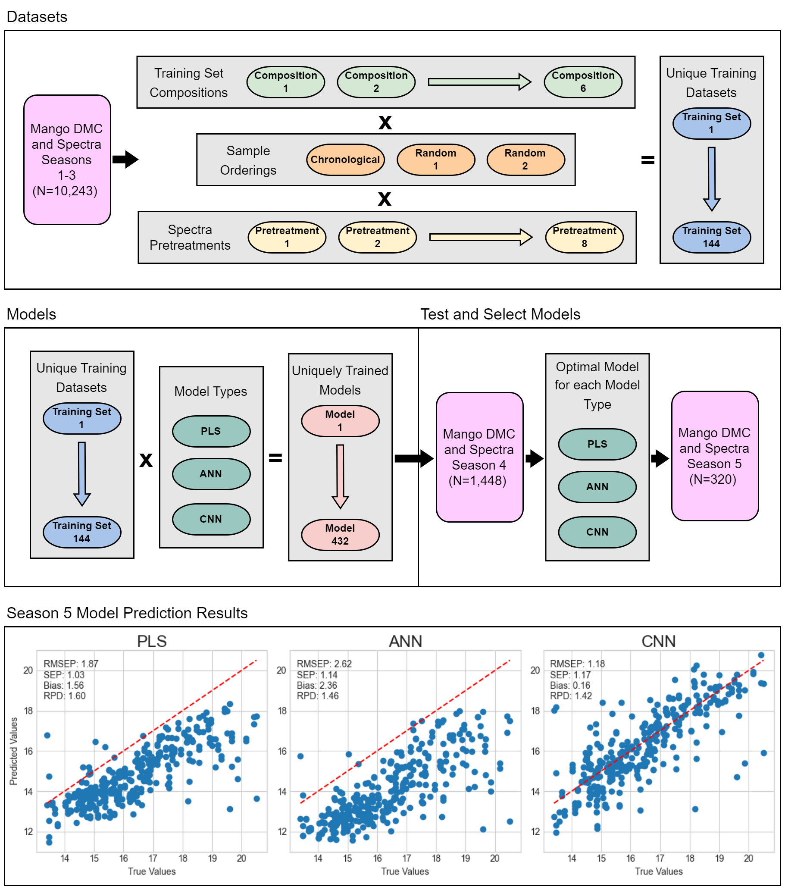
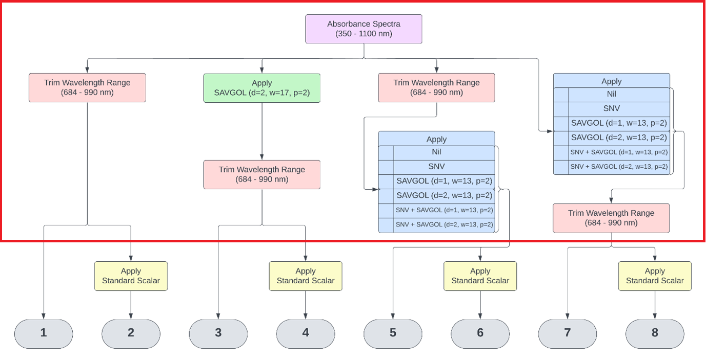

# Evaluation of 1D Convolutional Neural Network in Estimation of Mango Dry Matter Content

This repository accompanies the research presented in the publication:

**Walsh J, Neupane A, Li M. Evaluation of 1D Convolutional Neural Network in Estimation of Mango Dry Matter Content. *Spectrochimica Acta Part A: Molecular and Biomolecular Spectroscopy* 2024; DOI: [10.1016/j.saa.2024.124003](    
https://doi.org/10.1016/j.saa.2024.124003)**

The code within this repository was utilised to generate the results discussed in the aforementioned paper. All computational work was conducted using a laptop equipped with a 12th Gen Intel® Core™ i7-1265U 1.80 GHz processor, 32 GB of RAM, Windows 10 Enterprise operating system, and an Intel® Iris® Xe Graphics GPU with 16GB memory. The software environment comprised Python 3.10.4, and the [requirements.txt](requirements.txt) file specifies all necessary Python packages and libraries, along with their respective versions.

The additional season's worth of raw absorbance spectra, dry matter reference values, and sample metadata used in this study was incorporated into the original Mango DMC and spectra dataset by Anderson et al. 2020, hosted on Mendeley Data. This update, marked as version 3, is accessible at:  [data.mendeley.com/datasets/46htwnp833/3](https://data.mendeley.com/datasets/46htwnp833/3).


## Graphical Abstract



## Project Structure

### Data

The specific datasets needed to run this code are available on Mendeley Data at: [data.mendeley.com/datasets/mc9jshwb38](https://data.mendeley.com/datasets/mc9jshwb38)

The data should be downloaded, extracted and placed in this directory.

#### Directory Structure:
```
Eval-1D-CNN-Mango-DM
└── data
    ├── input
    │   ├── season_1_to_4
    │   │   ├── anderson&etal_2020_pretreatment.csv
    │   │   ├── mishra&passos_2021_pretreatment_adjusted.csv
    │   │   ├── mishra&passos_2021_pretreatment.csv
    │   │   └── nil_pretreatment.csv
    │   └── season_5
    │       ├── anderson&etal_2020_pretreatment.csv
    │       ├── mishra&passos_2021_pretreatment_adjusted.csv
    │       ├── mishra&passos_2021_pretreatment.csv
    │       └── nil_pretreatment.csv
    ├── predictions
    │   └── mishra&passos_2021_best_cnn.csv
    └── results
        ├── appendix_a_model_results.xlsx
        └── raw_results.csv
```

#### Input:
The input data files have been pretreated according to the methods outlined in the study, with application of the standard scalar performed within the provided notebooks as it depends on the final dataset composition. Consequently, the four distinct input files correspond to specific pretreatment pathways applied to the original absorbance spectra, as illustrated by the subsection of the following flowchart.



#### Predictions:
This directory contains sample predictions from trained models, including the previous best predictions on the season 4 test set `mishra&passos_2021_best_cnn.csv`, utilised in subsequent notebooks to compute the statistical significance of results from alternative models.

#### Results:
Execution of `main.py` will populate `raw_results.csv` with computed results for the trained models. The file `appendix_a_model_results.xlsx` contains these results, further processed and formatted for inclusion in the publication as an appendix.


### 1 Model Builds

**Notebook:** [1-model-builds.ipynb](1-model-builds.ipynb)

This notebook prepares one of the 144 unique training datasets described in the methodology section, then builds, trains, and tests the PLS, ANN, and CNN models. Model architectures and training parameters are specified in `utils/models.py`, while evaluation metrics and functions are defined in `utils/evaluation.py`. Models are trained using seasons 1 to 3 and evaluated on season 4.

`main.py` facilitates the execution of this notebook repeatedly, saving results for all unique training datasets.


### 2 Test Optimal Models

**Notebooks:** 
- [2-test-optimal-pls.ipynb](2-test-optimal-pls.ipynb)
- [2-test-optimal-ann.ipynb](2-test-optimal-ann.ipynb)
- [2-test-optimal-cnn.ipynb](2-test-optimal-cnn.ipynb)

These notebooks detail the optimal configurations for PLS, ANN, and CNN models, as determined from their performance on the season 4 test set. Each notebook uses the respective model to perform predictions on the season 5 dataset.


## Contact Information
Should you require additional information or have any questions regarding this study, please do not hesitate to get in touch through the following channels:

**Email**: jeremypaul.walsh@gmail.com

**LinkedIn:** [Jeremy Walsh](https://www.linkedin.com/in/jeremyp-walsh/)